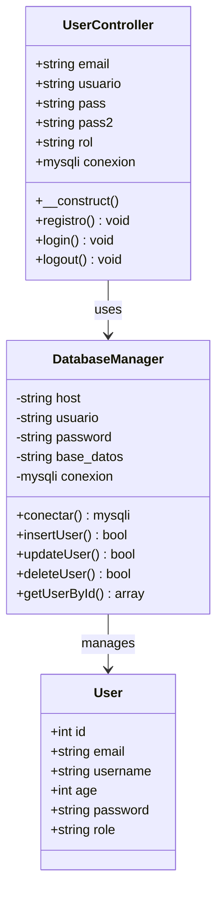
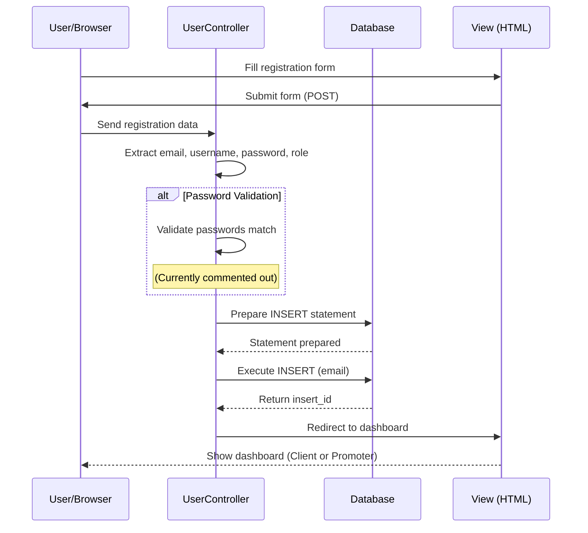
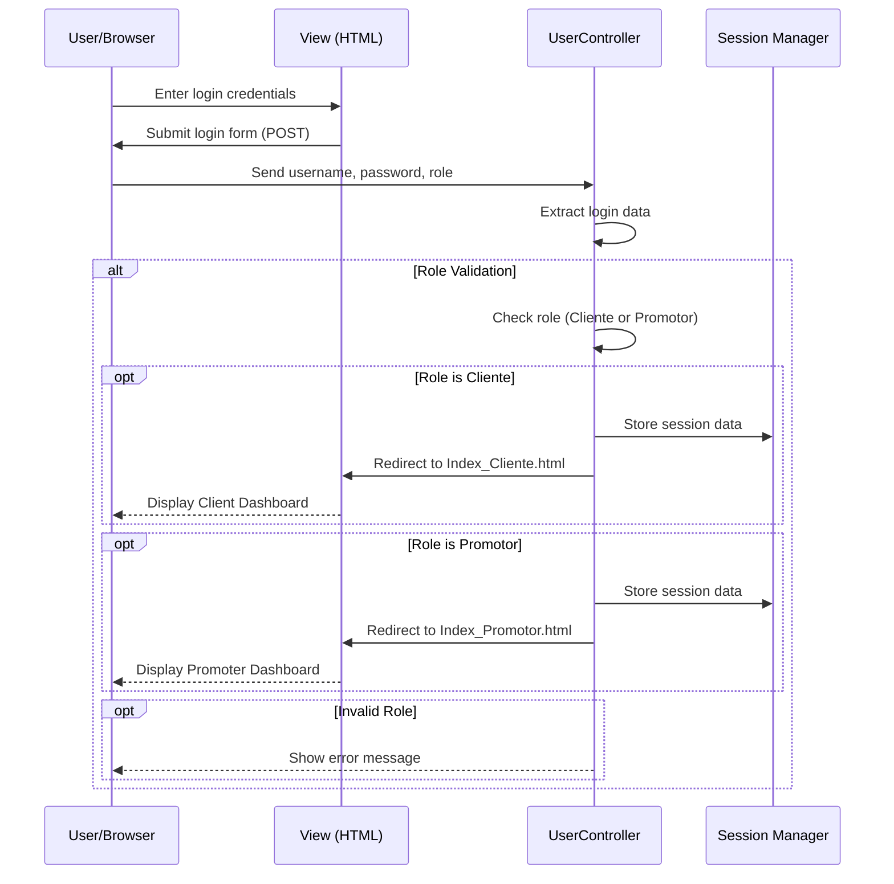

# Zentry - Event Management Platform

Zentry is a web application for managing and discovering events. It provides functionality for both regular users (Clientes) and event promoters (Promotores) to interact with events.

## Project Structure

```
Zentry/
├── Model/
│   ├── baseDatos.php        # Database connection and CRUD operations
│   └── baseDatos.sql        # Database schema
├── Controler/
│   └── controler.php        # User controller (login, registration, logout)
└── View/
    ├── index.html           # Home page
    ├── login.html           # Login page
    ├── registro-usuario.html # User registration
    ├── registro-promotor.html# Promoter registration
    ├── Index_Cliente.html    # Client dashboard
    ├── Index_Promotor.html   # Promoter dashboard
    ├── crear-evento.html     # Create event page
    ├── listado-evento.html   # Event listing
    ├── buscar-evento.html    # Event search
    ├── detalle-evento.html   # Event details
    ├── perfil-usuario.html   # User profile
    └── styles.css            # Styling
```

## Class Diagram

The following diagram shows the main class structure of the application:



## Sequence Diagram - User Registration Flow

The following diagram shows the sequence of events during user registration:



## Sequence Diagram - User Login Flow

The following diagram shows the sequence of events during user login:



## Database Schema

The application uses a MySQL database with the following main table:

### User Table
| Column   | Type    | Description      |
|----------|---------|------------------|
| id       | INT     | Primary Key      |
| email    | VARCHAR | User email       |
| username | VARCHAR | Username         |
| age      | INT     | User age         |
| password | VARCHAR | Hashed password  |
| role     | VARCHAR | User role (Cliente/Promotor) |

## Features

- **User Authentication**: Login and registration for both clients and promoters
- **Event Management**: Create, search, and view events
- **User Profiles**: Manage user profile information
- **Role-Based Access**: Different dashboards for clients and promoters
- **Event Details**: View detailed information about specific events

## Installation

1. Place the project in your XAMPP htdocs folder: `xampp/htdocs/zentryGames/Zentry/`
2. Create the MySQL database using `baseDatos.sql`
3. Update database credentials in `baseDatos.php` and `controler.php` if needed
4. Access the application through your local server: `http://localhost/zentryGames/Zentry/`

## Technologies Used

- **Backend**: PHP 7.x+
- **Database**: MySQL
- **Frontend**: HTML5, CSS3
- **Server**: Apache (XAMPP)

## Future Improvements

- [ ] Implement password hashing (use `password_hash()` and `password_verify()`)
- [ ] Add input validation and sanitization
- [ ] Implement proper error handling
- [ ] Create a service layer for database operations
- [ ] Add event management functionality
- [ ] Implement user profile management
- [ ] Add search and filter capabilities
